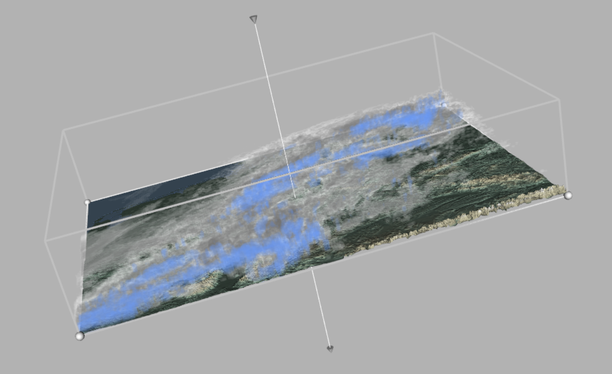

# Clouds Visualization


## Introduction
Visualization of meteorological cloud simulations using computer graphics techniques. Direct and indirect volume rendering, as well as other techniques, were employed to visualize the wind and the 3d clouds, with a focus on interactivity.
The visualized data comes from the [2017 IEEE SciVis visualization contest](http://sciviscontest.ieeevis.org/2017/)

## Contributors
[Davide Corigliano](https://github.com/daviC1999)
[Peter Haas](https://github.com/Pideeeh)
[Frawa Vetterli](https://github.com/vfrawa)
[Annika Öhri](https://github.com/oehria)

## Libraries
[VTK-9.0.1](https://vtk.org/)
[Libigl-2.4.0](https://libigl.github.io/)

## Setup
Place our dataset at ```./data```.

To build the project, [CMake](https://cmake.org) is needed. 
- First, the VTK library must be built according to this [guide](https://github.com/Kitware/VTK).
- Second, this project should be built in Cmake. It is necessary to explicitly point out the location of the VTK_library directory, under 'VTK DIR'.
- Finally, the project can be launched from MeteoAppLauncher.cpp

## Code description
Our cpp code can be found in this GitHub repository. Our main App can be Launched via MeteoAppLauncher.cpp and it contains most of our components and calculations. 
For visualization purposes, it was necessary to perform the resampling of the data beforehand, using resampling.cpp. The high-res terrain mesh was generated externally using [libigl](https://libigl.github.io/) in the ground_generation.cpp file and then downsampled using [Meshlab](https://www.meshlab.net/). The relevant results can be found under ```https://polybox.ethz.ch/index.php/s/rW5ULLZJKK7SMdK```. The files wind_2d.cpp is relevant for the wind computations, while LIC_builder.cpp includes our LIC texture generation. We compute high-resolution LIC textures beforehand so that the App shows better runtime.

## Data
We used large-dimension data files. Due to GitHub limits, we decided not to include our data files in this repository, we instead used a private shared repository. To request access to the data, write to [davide.cori.github@gmail.com](mailto:davide.cori.github@gmail.com%20Source%20Han%20Sans)

## Employed techniques
A detailed description of the employed visualization techniques can be found [here](https://github.com/daviC1999/Clouds-Visualization/blob/main/project_presentation.pdf).
